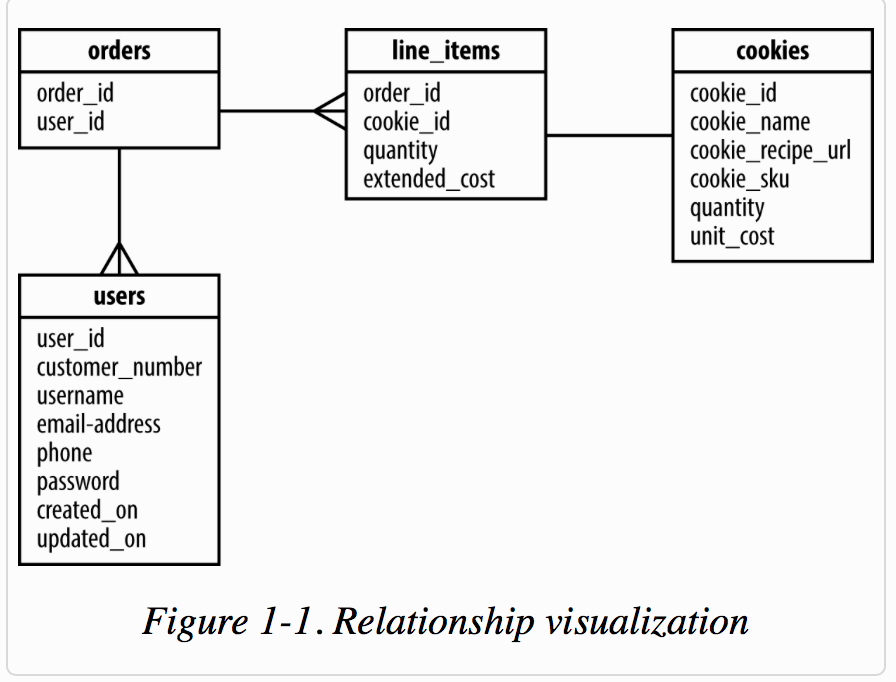
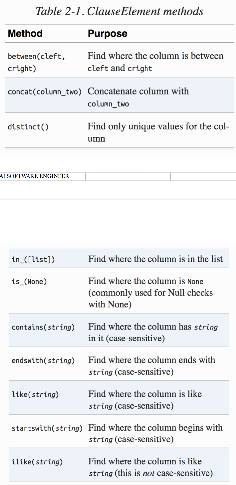
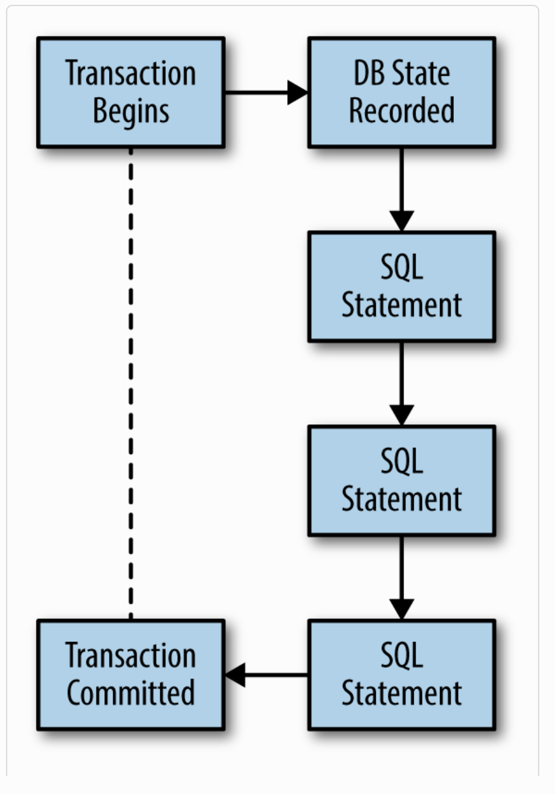
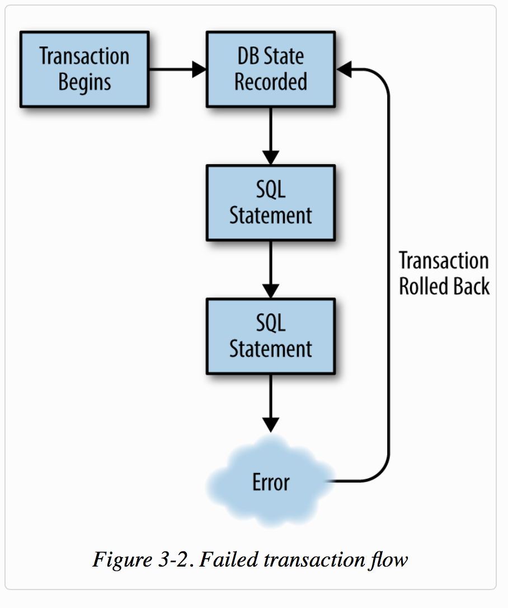

# sqlalchemy-orm

#### + Database Design :

#### + install sqlalchemy :
    - without c-extensions:
        --+ During the install, SQLAlchemy will attempt to build some C extensions,
            which are leveraged to make working with result sets fast and more memory efficient.
            If you need to disable these extensions due to the lack of a compiler on the system
            you are installing on, you can use --global-option=--without-cextensions.

            Note that using SQLAlchemy without C extensions will adversely affect performance,
            and you should test your code on a system with the C extensions prior to optimizing it.

            pip install --global-option=--without-cextensions sqlalchemy

Best practices &amp; Patterns to use SQLAlchemy-CORE &amp; SQLAlchemy ORM, for big applications

###  + ORM       |  Python     | SQLIte
.png)

### + ClauseElements - select

### + Successful transaction flow

### + transaction Error

    + However, if one or more of those statements fail, we can catch that error and use the prior state to roll back back any statements that succeeded.
     Figure above shows a transaction workflow in error.”

#### -> run tests:
    cd SQLAlchemy_BASICS_OPS
    python -m unittest test_app

#### -> create db sqlite from script sql:
    - from sql to db
       + cat chinook_db.sql | sqlite3 chnook.db
       + sqlite3 chnook.db < chinook_db.sql

    - from db to sql
       + sqlite3 Chinook_Sqlite.sqlite .dump > chinook_db.sql

+ check [chinook_db](http://chinookdatabase.codeplex.com/) the database that we used in the reflection part.
